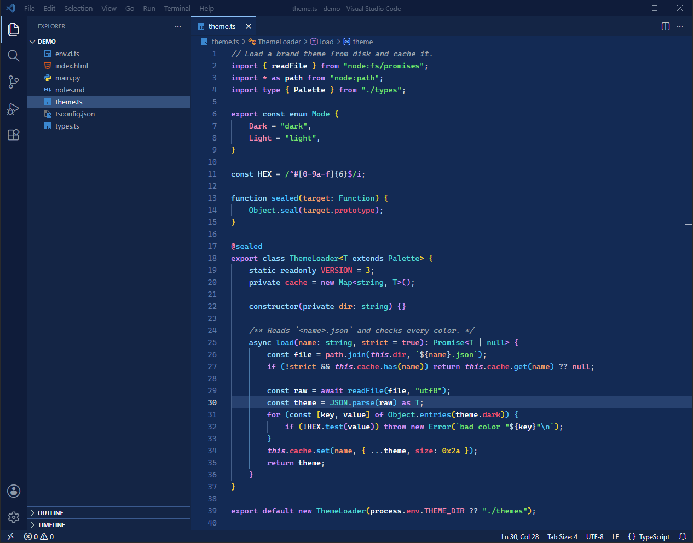
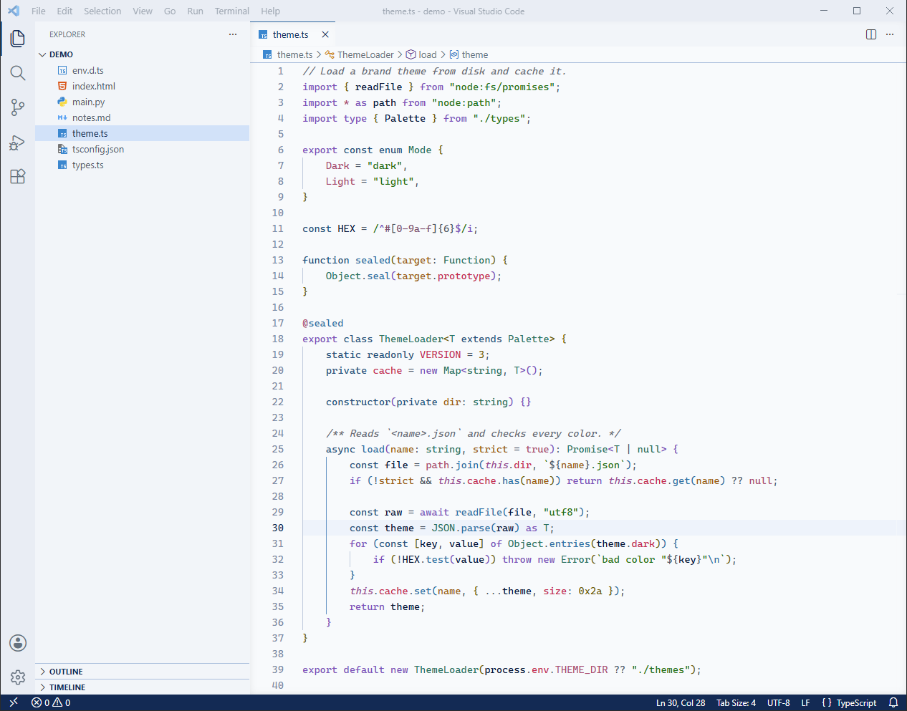

# Delφ Theme

Indigo blue dark and light color themes for VS Code. The dark theme uses the delφ brand blue `#062a55` as the editor background, and the light theme uses `#f8fafc`. The same palette is used by the delφ terminal UI.

| Delφ Dark | Delφ Light |
|---|---|
|  |  |

## Install

The theme is not on the Marketplace yet. Install it from a `.vsix` file:

1. Clone this repo.
2. Run `npm run package`. This makes `delphi-theme-0.1.0.vsix`.
3. Run `code --install-extension delphi-theme-0.1.0.vsix`.

## Activate

1. Open the Command Palette (`Ctrl+Shift+P`).
2. Select **Preferences: Color Theme**.
3. Select **Delφ Dark** or **Delφ Light**.

To switch with the OS light or dark mode, add this to your `settings.json`:

```json
"window.autoDetectColorScheme": true,
"workbench.preferredDarkColorTheme": "Delφ Dark",
"workbench.preferredLightColorTheme": "Delφ Light"
```

## Palette

The main syntax colors of Delφ Dark:

| Role | Color |
|---|---|
| Background | `#062a55` |
| Text | `#eef1f6` |
| Accent | `#7ec2fa` |
| Keyword | `#d396fe` |
| Declaration (`const`, `class`) | `#92ddff` |
| Function | `#12c5fe` |
| String | `#6be36c` |
| Number | `#fbd604` |
| Type | `#08dbd4` |
| Parameter | `#ff9e64` |
| Property, error | `#ff5071` |
| Constant, tag | `#ff89b0` |
| Comment | `#9fa5ae` |

`palette.json` has all the colors of both themes.

## Change the colors

To change a color in the themes:

1. Edit `palette.json`. It has a `dark` and a `light` object with the same keys.
2. Run `npm run build`. This writes `themes/delphi-dark.json` and `themes/delphi-light.json`.
3. Package and install again (see [Install](#install)).

To change one color only on your machine, use the settings that VS Code has for this:

```json
"workbench.colorCustomizations": {
	"[Delφ Dark]": { "editor.lineHighlightBackground": "#15395f" }
},
"editor.tokenColorCustomizations": {
	"[Delφ Dark]": { "comments": "#8a99aa" }
}
```

## Files

| Path | Contents |
|---|---|
| `palette.json` | The source colors, exported from the delφ palette page |
| `build.mjs` | Maps the palette to VS Code window colors, TextMate scopes and semantic tokens |
| `themes/` | The built theme files (commit them after each build) |
| `images/` | README screenshots of VS Code |

## License

[MIT](LICENSE)
